# 容器

# 1.概述

## 1.1.主机级虚拟化

在宿主机虚拟出一个完整的物理硬件平台，每一个平台都相当于一个独立的主机。有两种类型的实现

1.在宿主机上直接安装Virtual machine Manager，不需要在宿主机上安装操作系统，如：Xen、ESX/ESXi

2.需要基于宿主机的操作系统之上安装Virtual Machine Manager,然后在VM中安装新的操作系统。VMware Workstation、Kvm、VirtualBox

## 1.2.容器级虚拟化

Linux Namespaces

UTS（主机名域名），Mount（文件系统），IPC（进程间通信），PID（进程id），User（用户），Net （网络）

| namespace | 系统调用参数  | 隔离内容                   | 内核版本 |
| --------- | ------------- | -------------------------- | -------- |
| UTS       | CLONE_NEWUTS  | 主机名和域名               | 2.6.19   |
| IPC       | CLONE_NEWIPC  | 信号量、消息队列和共享内容 | 2.6.19   |
| PID       | CLONE_NEWPID  | 进程编号                   | 2.6.24   |
| Network   | CLONE_NEWNET  | 网络信号、网络栈、端口等   | 2.6.29   |
| Mount     | CLONE_NEWNS   | 挂载点（文件系统）         | 2.4.19   |
| User      | CLONE_NEWUSER | 用户和用户组               | 3.8      |

Control Groups（cgroups）

blkio：块设备IO
cpu:：CPU
cpuacct：CPU资源使用报告
cpuset：多处理器平台上的CPU集合
devices：设备访问
freezer：挂起或恢复任务
memory：内存用量及报告
perf_event：对 cgroup中的任务进行统一性能测试
net_cls： cgroup中的任务创建的数据报文的类别标识符

## 1.3.LXC（linux container）

Linux Container容器是一种内核虚拟化技术，可以提供轻量级的虚拟化，以便隔离进程和资源。

## 1.4.Docker

OCI,OCF

lxc->libcontainer->runC

docker架构

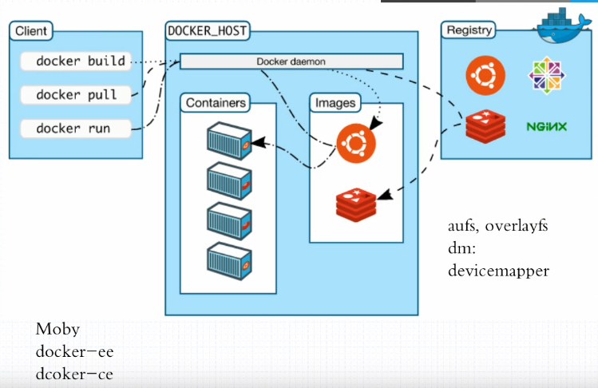

docker objects

images

container

networks

volumes

plugins......

# 2.Docker

## 2.1.安装

1.使用官方安装脚本自动安装 （仅适用于公网环境）

```shell
curl -fsSL https://get.docker.com | bash -s docker --mirror Aliyun
```

2.手动安装

Ubuntu：

```shell
# step 1: 安装必要的一些系统工具
sudo apt-get update
sudo apt-get -y install apt-transport-https ca-certificates curl software-properties-common
# step 2: 安装GPG证书
curl -fsSL http://mirrors.aliyun.com/docker-ce/linux/ubuntu/gpg | sudo apt-key add -
# Step 3: 写入软件源信息
sudo add-apt-repository "deb [arch=amd64] http://mirrors.aliyun.com/docker-ce/linux/ubuntu $(lsb_release -cs) stable"
# Step 4: 更新并安装 Docker-CE
sudo apt-get -y update
sudo apt-get -y install docker-ce

注意：其他注意事项在下面的注释中
# 安装指定版本的Docker-CE:
# Step 1: 查找Docker-CE的版本:
# apt-cache madison docker-ce
#   docker-ce | 17.03.1~ce-0~ubuntu-xenial | http://mirrors.aliyun.com/docker-ce/linux/ubuntu xenial/stable amd64 Packages
#   docker-ce | 17.03.0~ce-0~ubuntu-xenial | http://mirrors.aliyun.com/docker-ce/linux/ubuntu xenial/stable amd64 Packages
# Step 2: 安装指定版本的Docker-CE: (VERSION 例如上面的 17.03.1~ce-0~ubuntu-xenial)
# sudo apt-get -y install docker-ce=[VERSION]

# 通过经典网络、VPC网络内网安装时，用以下命令替换Step 2、Step 3中的命令
# 经典网络：
# curl -fsSL http://mirrors.aliyuncs.com/docker-ce/linux/ubuntu/gpg | sudo apt-key add -
# sudo add-apt-repository "deb [arch=amd64] http://mirrors.aliyuncs.com/docker-ce/linux/ubuntu $(lsb_release -cs) stable"
# VPC网络：
# curl -fsSL http://mirrors.cloud.aliyuncs.com/docker-ce/linux/ubuntu/gpg | sudo apt-key add -
# sudo add-apt-repository "deb [arch=amd64] http://mirrors.cloud.aliyuncs.com/docker-ce/linux/ubuntu $(lsb_release -cs) stable"
```

Centos:

```shell
# step 1: 安装必要的一些系统工具
sudo yum install -y yum-utils device-mapper-persistent-data lvm2
# Step 2: 添加软件源信息
sudo yum-config-manager --add-repo http://mirrors.aliyun.com/docker-ce/linux/centos/docker-ce.repo
# Step 3: 更新并安装 Docker-CE
sudo yum makecache fast
sudo yum -y install docker-ce
# Step 4: 开启Docker服务
sudo service docker start

注意：其他注意事项在下面的注释中
# 官方软件源默认启用了最新的软件，您可以通过编辑软件源的方式获取各个版本的软件包。例如官方并没有将测试版本的软件源置为可用，你可以通过以下方式开启。同理可以开启各种测试版本等。
# vim /etc/yum.repos.d/docker-ce.repo
#   将 [docker-ce-test] 下方的 enabled=0 修改为 enabled=1
#
# 安装指定版本的Docker-CE:
# Step 1: 查找Docker-CE的版本:
# yum list docker-ce.x86_64 --showduplicates | sort -r
#   Loading mirror speeds from cached hostfile
#   Loaded plugins: branch, fastestmirror, langpacks
#   docker-ce.x86_64            17.03.1.ce-1.el7.centos            docker-ce-stable
#   docker-ce.x86_64            17.03.1.ce-1.el7.centos            @docker-ce-stable
#   docker-ce.x86_64            17.03.0.ce-1.el7.centos            docker-ce-stable
#   Available Packages
# Step2 : 安装指定版本的Docker-CE: (VERSION 例如上面的 17.03.0.ce.1-1.el7.centos)
# sudo yum -y install docker-ce-[VERSION]
# 注意：在某些版本之后，docker-ce安装出现了其他依赖包，如果安装失败的话请关注错误信息。例如 docker-ce 17.03 之后，需要先安装 docker-ce-selinux。
# yum list docker-ce-selinux- --showduplicates | sort -r
# sudo yum -y install docker-ce-selinux-[VERSION]

# 通过经典网络、VPC网络内网安装时，用以下命令替换Step 2中的命令
# 经典网络：
# sudo yum-config-manager --add-repo http://mirrors.aliyuncs.com/docker-ce/linux/centos/docker-ce.repo
# VPC网络：
# sudo yum-config-manager --add-repo http://mirrors.could.aliyuncs.com/docker-ce/linux/centos/docker-ce.repo
```

验证是否成功：

```shell
[root@yifeng etc]# docker version
Client: Docker Engine - Community
 Version:           19.03.5
 API version:       1.40
 Go version:        go1.12.12
 Git commit:        633a0ea
 Built:             Wed Nov 13 07:25:41 2019
 OS/Arch:           linux/amd64
 Experimental:      false

Server: Docker Engine - Community
 Engine:
  Version:          19.03.5
  API version:      1.40 (minimum version 1.12)
  Go version:       go1.12.12
  Git commit:       633a0ea
  Built:            Wed Nov 13 07:24:18 2019
  OS/Arch:          linux/amd64
  Experimental:     false
 containerd:
  Version:          1.2.10
  GitCommit:        b34a5c8af56e510852c35414db4c1f4fa6172339
 runc:
  Version:          1.0.0-rc8+dev
  GitCommit:        3e425f80a8c931f88e6d94a8c831b9d5aa481657
 docker-init:
  Version:          0.18.0
  GitCommit:        fec3683

```

配置镜像加速：daemon.json可能不存在，没有的话就新建了一个

```
vim /etc/docker/daemon.json
```

加入以下配置，这里的阿里云镜像加速自己在阿里云注册一个账号就有了。

```
{
  "registry-mirrors": ["https://5gobpdba.mirror.aliyuncs.com"]
}
```

这里的镜像服务器是一个数组的配置，所以可以配置多个镜像，中间用逗号隔开即可

重启docker

```
systemctl restart docker
```

## 2.2.常用命令：

输入docker可以查看所有的命令及介绍：

```
docker
```

```shell
Management Commands:
  builder     Manage builds
  config      Manage Docker configs
  container   Manage containers
  context     Manage contexts
  engine      Manage the docker engine
  image       Manage images
  network     Manage networks
  node        Manage Swarm nodes
  plugin      Manage plugins
  secret      Manage Docker secrets
  service     Manage services
  stack       Manage Docker stacks
  swarm       Manage Swarm
  system      Manage Docker
  trust       Manage trust on Docker images
  volume      Manage volumes

Commands:
  attach      Attach local standard input, output, and error streams to a running container
  build       Build an image from a Dockerfile
  commit      Create a new image from a container's changes
  cp          Copy files/folders between a container and the local filesystem
  create      Create a new container
  diff        Inspect changes to files or directories on a container's filesystem
  events      Get real time events from the server
  exec        Run a command in a running container
  export      Export a container's filesystem as a tar archive
  history     Show the history of an image
  images      List images
  import      Import the contents from a tarball to create a filesystem image
  info        Display system-wide information
  inspect     Return low-level information on Docker objects
  kill        Kill one or more running containers
  load        Load an image from a tar archive or STDIN
  login       Log in to a Docker registry
  logout      Log out from a Docker registry
  logs        Fetch the logs of a container
  pause       Pause all processes within one or more containers
  port        List port mappings or a specific mapping for the container
  ps          List containers
  pull        Pull an image or a repository from a registry
  push        Push an image or a repository to a registry
  rename      Rename a container
  restart     Restart one or more containers
  rm          Remove one or more containers
  rmi         Remove one or more images
  run         Run a command in a new container
  save        Save one or more images to a tar archive (streamed to STDOUT by default)
  search      Search the Docker Hub for images
  start       Start one or more stopped containers
  stats       Display a live stream of container(s) resource usage statistics
  stop        Stop one or more running containers
  tag         Create a tag TARGET_IMAGE that refers to SOURCE_IMAGE
  top         Display the running processes of a container
  unpause     Unpause all processes within one or more containers
  update      Update configuration of one or more containers
  version     Show the Docker version information
  wait        Block until one or more containers stop, then print their exit codes

```

命令主要分为两类，一类是管理命令Management Commands，这是后面的高版本才出现的，是对原先的一些命令进行了分组。

比如我们拉取一个镜像可以使用：

```
docker pull nginx
```

也可以使用

```
docker image pull nginx
```

查看docker详细信息

```
docker info
```

```shell
Client:
 Debug Mode: false

Server:
 Containers: 0
  Running: 0
  Paused: 0
  Stopped: 0
 Images: 0
 Server Version: 19.03.5
 Storage Driver: overlay2
  Backing Filesystem: extfs
  Supports d_type: true
  Native Overlay Diff: true
 Logging Driver: json-file
 Cgroup Driver: cgroupfs
 Plugins:
  Volume: local
  Network: bridge host ipvlan macvlan null overlay
  Log: awslogs fluentd gcplogs gelf journald json-file local logentries splunk syslog
 Swarm: inactive
 Runtimes: runc
 Default Runtime: runc
 Init Binary: docker-init
 containerd version: b34a5c8af56e510852c35414db4c1f4fa6172339
 runc version: 3e425f80a8c931f88e6d94a8c831b9d5aa481657
 init version: fec3683
 Security Options:
  seccomp
   Profile: default
 Kernel Version: 3.10.0-862.el7.x86_64
 Operating System: CentOS Linux 7 (Core)
 OSType: linux
 Architecture: x86_64
 CPUs: 2
 Total Memory: 3.701GiB
 Name: yifeng
 ID: NBOA:IV64:ZQIQ:QUFE:YTET:LR6E:IQQ3:NMHC:DDM3:Z5QK:QAFK:PQAO
 Docker Root Dir: /var/lib/docker
 Debug Mode: false
 Registry: https://index.docker.io/v1/
 Labels:
 Experimental: false
 Insecure Registries:
  127.0.0.0/8
 Registry Mirrors:
  https://5gobpdba.mirror.aliyuncs.com/
 Live Restore Enabled: false
```

上面的Registry Mirrors就是我们自己配置的镜像加速服务器。

```markdown
docker search: Search the Docker Hub for images 搜索镜像
docker pull: Pull an image or a repository from a registry 拉取下载镜像
docker images: List images 列出本地所有镜像
docker create: Create a new container 创建一个新的容器
docker start: Start one or more stopped containers 开启容器
docker run: Run a command in a new container 
docker attach: Attach to a running container
docker ps: List containers
docker logs Fetch the logs of a container
docker restart: Restart a container
docker stop: Stop one or more running containers
docker kill: Kill one or more running containers
docker rm: Remove one or more containers
```

启动容器，如果没有则自动从仓库中拉取镜像

```
docker run --name redis1 -d redis
```

进入交互式界面

```
docker exec -it redis1 /bin/sh
redis-cli
```

查看日志

```
docker logs redis1
```


docker的状态转换示意图：

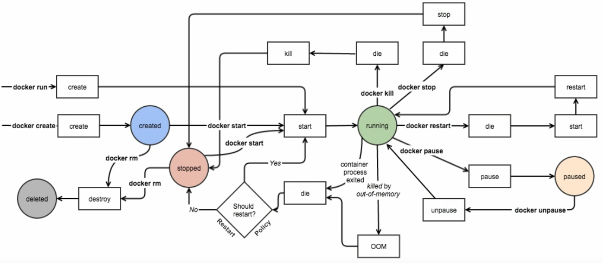

## 2.3.镜像

Docker镜像含有启动容器所需要的文件系统及其内容,因此,其用于创建并启动 docker容器
采用分层构建机制,最底层为 bootfs,其之为rootfs


- bootfs:用于系统引导的文件系统,包括 bootloader和 kernel,容器启动完成后会被卸载以节约内存资源;
- rootfs:位于boot之上,表现为 docker容器的根文件系统
  - 传统模式中,系统启动之时,内核挂载root压时会首先将其挂载为“只读”模式,完整性自检完成后将其重新挂载为读写模式;
  - docker中, rootfs由内核挂栽为“只读”模式,而后通过“联合挂载"技术额外挂载一个“可写”"层
  - 位于下层的镜像称为父镜像 parent Image),最底层的称为基础镜像(base Image）
  - 最上层为“可读写"层,其下的均为"只读”层
  - 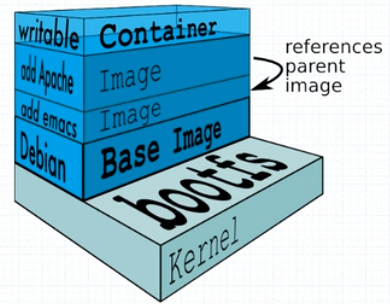

## 2.4.文件系统

AUFS

- advanced multi- layered unification filesystem;高级多层统一文件系统
- 用于为 Linux文件系统实现“联合挂载“
- aufs是之前的 UnionFS的重新实现,2006年由 Junjiro Okajima开发
- Docker最初使用aufs作为容器文件系统层,它目前仍作为存储后端之一来支持;
- aufs的竞争产品是 overlayfs,后者自从3.18版本开始被合并到 Linux内核;
- dockers的分层镜像,除了aufs, docker还支持btrfs, devicemapper和vfs等
  ・在 Ubuntu系统下, docker默认 Ubuntu的aufs;而在 Centos7上,用的是 devicemapper;在新版的centos中使用的是overlay2文件系统，安装完docker之后，可以使用docker info命令查看

## 2.5.Docker Registry

启动容器时, docker daemon?会试图从本地获取相关的镜像;本地镜像不存在时,其将Registry中下载该镜像并保存到本地

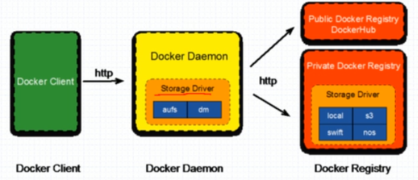


Registry用于保存 docker镜像,包括镜像的层次结构和元数据
用户可自建 Registry,也可使用官方的 Docker Hub
分类
Sponsor Registry：第三方的 registry,供客户和docker社区使用
Mirror Registry：第三方的 registry,只让客户使用
Vendor Registry：由发布 Dockers镜像的供应商提供的 registry
Private Registry：通过设有防火墙和额外的安全层的私有实体提供的 registry

Registry(Repository and Index)

Repository
	由某特定的 docker镜像的所有迭代版本组成的镜像仓库
	一个 Registry中可以存在多个 Repository
		Repository可分为“顶层仓库”和“用户仓库"
		用户仓库名称格式为“用户名/仓库名”
	每个仓库可以包含多个Tag(标签),每个标签对应一个镜像

Index

​	维护用户帐户、镜像的校验以及公共命名空间的信息
​	相当于为 Registry提供了一个完成用户认证等功能的检索接口

Docker Registry中的镜像通常由开发人员制作,而后推送至'公共"或私有" Registry"上保存,供其他人员使用,例如“部署”到生产环境;

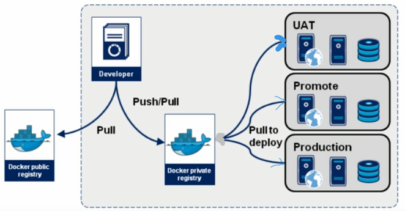

Docker hub

Docker Hub provides the following major features
	Image Repositories
		Find and pull images from community and official libraries, and manage, push to, and pull from
		private image libraries to which you have access
	Automated Builds
		Automatically create new images when you make changes to a source code repository.
	Webbooks
		A feature of Automated Builds, Webhooks It you trigger actions after a successful push to a
		repository
	Organizations
		Create work groups to manage access to image repositories
	Github and Bitbucket Integration
		Add the Hub and your Docker Images to your current workflows.

Getting images from remote Docker registries

```
docker pull <registry>[:<port>]/[<namespace>/]<name>:<tag>
docker pull quay.io/coreos/flannel:v0.11.0-amd64
```

namespace可能是organization、login(username)、role等

镜像的相关操作

镜像的生成途径：

​	Dockerfile

​	基于容器制作

```
docker commit [OPTIONS] CONTAINER [REPOSITORYE: [TAG]]
docker commit -p b1
docker tag 595d8d10ecf3 yifeng/httpd:v0.1
docker commit -a "yifeng<624999806@qq.com>" -c 'CMD ["/bin/httpd","-f","-h","/data/html"]' -p b1 yifeng/httpd:v0.2

```

​	Docker Hub automated builds

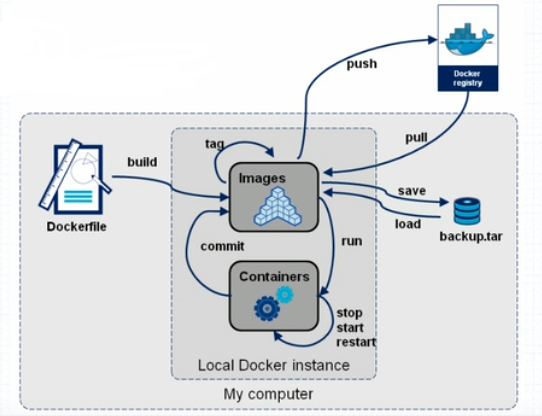

镜像的导入和导出：

```
docker save
docker save -o myimages.gz yifeng/httpd:latest yifeng/httpd:v0.2 
docker load
docker load -i myimages.gz
```

## 2.6.Docker Network

OVS：Open VSwitch

SDN：software define Network

Overlay Network：叠加网络

```shell
[root@yifeng ~]# docker network ls
NETWORK ID          NAME                DRIVER              SCOPE
5405040e1fa6        bridge              bridge              local
a30029c1b67f        host                host                local
9acfa19886e7        none                null                local
```

```shell
[root@yifeng ~]# ifconfig
docker0: flags=4163<UP,BROADCAST,RUNNING,MULTICAST>  mtu 1500
        inet 172.17.0.1  netmask 255.255.0.0  broadcast 172.17.255.255
        inet6 fe80::42:f7ff:feaf:67ab  prefixlen 64  scopeid 0x20<link>
        ether 02:42:f7:af:67:ab  txqueuelen 0  (Ethernet)
        RX packets 23  bytes 2351 (2.2 KiB)
        RX errors 0  dropped 0  overruns 0  frame 0
        TX packets 33  bytes 2400 (2.3 KiB)
        TX errors 0  dropped 0 overruns 0  carrier 0  collisions 0

eth0: flags=4163<UP,BROADCAST,RUNNING,MULTICAST>  mtu 1500
        inet 172.21.0.2  netmask 255.255.240.0  broadcast 172.21.15.255
        inet6 fe80::5054:ff:fe69:960e  prefixlen 64  scopeid 0x20<link>
        ether 52:54:00:69:96:0e  txqueuelen 1000  (Ethernet)
        RX packets 10507707  bytes 1283024903 (1.1 GiB)
        RX errors 0  dropped 0  overruns 0  frame 0
        TX packets 11589270  bytes 1572097015 (1.4 GiB)
        TX errors 0  dropped 0 overruns 0  carrier 0  collisions 0

lo: flags=73<UP,LOOPBACK,RUNNING>  mtu 65536
        inet 127.0.0.1  netmask 255.0.0.0
        inet6 ::1  prefixlen 128  scopeid 0x10<host>
        loop  txqueuelen 1000  (Local Loopback)
        RX packets 156  bytes 9740 (9.5 KiB)
        RX errors 0  dropped 0  overruns 0  frame 0
        TX packets 156  bytes 9740 (9.5 KiB)
        TX errors 0  dropped 0 overruns 0  carrier 0  collisions 0

veth0e24eea: flags=4163<UP,BROADCAST,RUNNING,MULTICAST>  mtu 1500
        inet6 fe80::f031:6cff:fe8e:ce3e  prefixlen 64  scopeid 0x20<link>
        ether f2:31:6c:8e:ce:3e  txqueuelen 0  (Ethernet)
        RX packets 8  bytes 704 (704.0 B)
        RX errors 0  dropped 0  overruns 0  frame 0
        TX packets 16  bytes 1210 (1.1 KiB)
        TX errors 0  dropped 0 overruns 0  carrier 0  collisions 0

veth28836b8: flags=4163<UP,BROADCAST,RUNNING,MULTICAST>  mtu 1500
        inet6 fe80::586f:8ff:fecf:2a25  prefixlen 64  scopeid 0x20<link>
        ether 5a:6f:08:cf:2a:25  txqueuelen 0  (Ethernet)
        RX packets 0  bytes 0 (0.0 B)
        RX errors 0  dropped 0  overruns 0  frame 0
        TX packets 9  bytes 690 (690.0 B)
        TX errors 0  dropped 0 overruns 0  carrier 0  collisions 0

veth96804d5: flags=4163<UP,BROADCAST,RUNNING,MULTICAST>  mtu 1500
        inet6 fe80::249f:ff:fee3:ab7d  prefixlen 64  scopeid 0x20<link>
        ether 26:9f:00:e3:ab:7d  txqueuelen 0  (Ethernet)
        RX packets 0  bytes 0 (0.0 B)
        RX errors 0  dropped 0  overruns 0  frame 0
        TX packets 9  bytes 690 (690.0 B)
        TX errors 0  dropped 0 overruns 0  carrier 0  collisions 0

veth9e5cb19: flags=4163<UP,BROADCAST,RUNNING,MULTICAST>  mtu 1500
        inet6 fe80::e83a:ccff:fe23:87ad  prefixlen 64  scopeid 0x20<link>
        ether ea:3a:cc:23:87:ad  txqueuelen 0  (Ethernet)
        RX packets 0  bytes 0 (0.0 B)
        RX errors 0  dropped 0  overruns 0  frame 0
        TX packets 9  bytes 690 (690.0 B)
        TX errors 0  dropped 0 overruns 0  carrier 0  collisions 0

vethc4e1008: flags=4163<UP,BROADCAST,RUNNING,MULTICAST>  mtu 1500
        inet6 fe80::902e:c8ff:fe02:e971  prefixlen 64  scopeid 0x20<link>
        ether 92:2e:c8:02:e9:71  txqueuelen 0  (Ethernet)
        RX packets 7  bytes 1272 (1.2 KiB)
        RX errors 0  dropped 0  overruns 0  frame 0
        TX packets 18  bytes 1318 (1.2 KiB)
        TX errors 0  dropped 0 overruns 0  carrier 0  collisions 0
```

```shell
[root@yifeng ~]# docker ps
CONTAINER ID        IMAGE                 COMMAND                  CREATED             STATUS              PORTS               NAMES
d65b40798bad        yifeng/httpd:v0.2     "/bin/httpd -f -h /d…"   19 hours ago        Up 19 hours                             t2
a2a783363257        yifeng/httpd:latest   "sh"                     19 hours ago        Up 19 hours                             t1
4da82fc11559        busybox               "sh"                     19 hours ago        Up 19 hours                             b1
320717e03d89        redis:latest          "docker-entrypoint.s…"   44 hours ago        Up 43 hours         6379/tcp            redis1
dc178c7aa39c        nginx                 "nginx -g 'daemon of…"   44 hours ago        Up 44 hours         80/tcp              web1
```

这里启动了五个docker容器，所以在宿主机上面有五个虚拟的网卡地址，都是桥接在docker0上面的

```shell
yum -y install bridge-utils
[root@yifeng ~]# brctl show
bridge name	bridge id		STP enabled	interfaces
docker0		8000.0242f7af67ab	no		veth0e24eea
										veth28836b8
										veth96804d5
										veth9e5cb19
										vethc4e1008
```

```shell
[root@yifeng ~]# ip link show
1: lo: <LOOPBACK,UP,LOWER_UP> mtu 65536 qdisc noqueue state UNKNOWN mode DEFAULT group default qlen 1000
    link/loopback 00:00:00:00:00:00 brd 00:00:00:00:00:00
2: eth0: <BROADCAST,MULTICAST,UP,LOWER_UP> mtu 1500 qdisc mq state UP mode DEFAULT group default qlen 1000
    link/ether 52:54:00:69:96:0e brd ff:ff:ff:ff:ff:ff
3: docker0: <BROADCAST,MULTICAST,UP,LOWER_UP> mtu 1500 qdisc noqueue state UP mode DEFAULT group default 
    link/ether 02:42:f7:af:67:ab brd ff:ff:ff:ff:ff:ff
11: vethc4e1008@if10: <BROADCAST,MULTICAST,UP,LOWER_UP> mtu 1500 qdisc noqueue master docker0 state UP mode DEFAULT group default 
    link/ether 92:2e:c8:02:e9:71 brd ff:ff:ff:ff:ff:ff link-netnsid 0
17: veth96804d5@if16: <BROADCAST,MULTICAST,UP,LOWER_UP> mtu 1500 qdisc noqueue master docker0 state UP mode DEFAULT group default 
    link/ether 26:9f:00:e3:ab:7d brd ff:ff:ff:ff:ff:ff link-netnsid 1
21: veth9e5cb19@if20: <BROADCAST,MULTICAST,UP,LOWER_UP> mtu 1500 qdisc noqueue master docker0 state UP mode DEFAULT group default 
    link/ether ea:3a:cc:23:87:ad brd ff:ff:ff:ff:ff:ff link-netnsid 2
23: veth28836b8@if22: <BROADCAST,MULTICAST,UP,LOWER_UP> mtu 1500 qdisc noqueue master docker0 state UP mode DEFAULT group default 
    link/ether 5a:6f:08:cf:2a:25 brd ff:ff:ff:ff:ff:ff link-netnsid 3
25: veth0e24eea@if24: <BROADCAST,MULTICAST,UP,LOWER_UP> mtu 1500 qdisc noqueue master docker0 state UP mode DEFAULT group default 
    link/ether f2:31:6c:8e:ce:3e brd ff:ff:ff:ff:ff:ff link-netnsid 4

```

```shell
[root@yifeng ~]# iptables -t nat -vnL
Chain PREROUTING (policy ACCEPT 197K packets, 7623K bytes)
 pkts bytes target     prot opt in     out     source               destination         
 197K 7623K DOCKER     all  --  *      *       0.0.0.0/0            0.0.0.0/0            ADDRTYPE match dst-type LOCAL

Chain INPUT (policy ACCEPT 197K packets, 7623K bytes)
 pkts bytes target     prot opt in     out     source               destination         

Chain OUTPUT (policy ACCEPT 90981 packets, 5590K bytes)
 pkts bytes target     prot opt in     out     source               destination         
    0     0 DOCKER     all  --  *      *       0.0.0.0/0           !127.0.0.0/8          ADDRTYPE match dst-type LOCAL

Chain POSTROUTING (policy ACCEPT 90981 packets, 5590K bytes)
 pkts bytes target     prot opt in     out     source               destination         
    1    84 MASQUERADE  all  --  *      !docker0  172.17.0.0/16        0.0.0.0/0           

Chain DOCKER (2 references)
 pkts bytes target     prot opt in     out     source               destination         
    1    84 RETURN     all  --  docker0 *       0.0.0.0/0            0.0.0.0/0    
```

```shell
wget -O - -q http://172.17.0.2 #功能相当于 curl http://172.17.0.2
```

docker容器内部可以互相访问，宿主机也可以访问docker服务，那么外部的主机如何来访问docker中的服务呢？

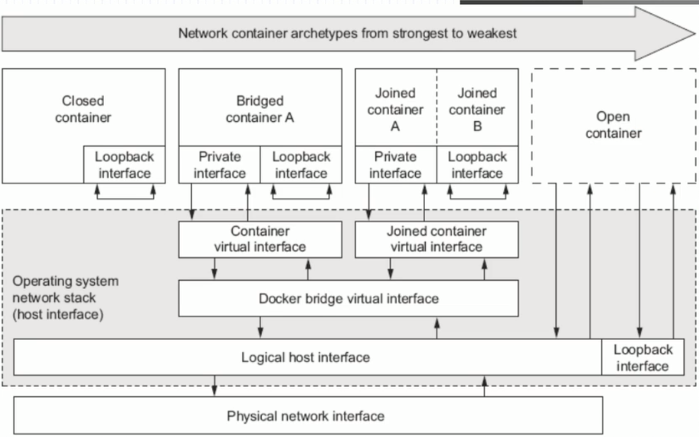

```shell
[root@yifeng ~]# ip netns help
Usage: ip netns list
       ip netns add NAME
       ip netns set NAME NETNSID
       ip [-all] netns delete [NAME]
       ip netns identify [PID]
       ip netns pids NAME
       ip [-all] netns exec [NAME] cmd ...
       ip netns monitor
       ip netns list-id

```

```shell
[root@yifeng ~]# ip netns add r1
[root@yifeng ~]# ip netns list
r1
[root@yifeng ~]# ip netns add r2
[root@yifeng ~]# ip netns list
r2
r1
[root@yifeng ~]# ip netns exec r1 ifconfig
[root@yifeng ~]# ip netns exec r1 ifconfig -a
lo: flags=8<LOOPBACK>  mtu 65536
        loop  txqueuelen 1000  (Local Loopback)
        RX packets 0  bytes 0 (0.0 B)
        RX errors 0  dropped 0  overruns 0  frame 0
        TX packets 0  bytes 0 (0.0 B)
        TX errors 0  dropped 0 overruns 0  carrier 0  collisions 0

```

添加虚拟网卡：

```shell
[root@yifeng ~]# ip link add name veth1.1 type veth peer name veth1.2
[root@yifeng ~]# ip link show
26: veth1.2@veth1.1: <BROADCAST,MULTICAST,M-DOWN> mtu 1500 qdisc noop state DOWN mode DEFAULT group default qlen 1000
    link/ether 6a:a5:73:66:12:85 brd ff:ff:ff:ff:ff:ff
27: veth1.1@veth1.2: <BROADCAST,MULTICAST,M-DOWN> mtu 1500 qdisc noop state DOWN mode DEFAULT group default qlen 1000
    link/ether 06:ce:c7:11:b7:d7 brd ff:ff:ff:ff:ff:ff
```

将网卡移动到网络名称空间中

```shell
[root@yifeng ~]# ip link set dev veth1.2 netns r1
[root@yifeng ~]# ip netns exec r1 ifconfig -a
lo: flags=8<LOOPBACK>  mtu 65536
        loop  txqueuelen 1000  (Local Loopback)
        RX packets 0  bytes 0 (0.0 B)
        RX errors 0  dropped 0  overruns 0  frame 0
        TX packets 0  bytes 0 (0.0 B)
        TX errors 0  dropped 0 overruns 0  carrier 0  collisions 0

veth1.2: flags=4098<BROADCAST,MULTICAST>  mtu 1500
        ether 6a:a5:73:66:12:85  txqueuelen 1000  (Ethernet)
        RX packets 0  bytes 0 (0.0 B)
        RX errors 0  dropped 0  overruns 0  frame 0
        TX packets 0  bytes 0 (0.0 B)
        TX errors 0  dropped 0 overruns 0  carrier 0  collisions 0

```

将网卡进行改名：

```shell
[root@yifeng ~]# ip netns exec r1 ip link set dev veth1.2 name eth0
[root@yifeng ~]# ip netns exec r1 ifconfig -a
eth0: flags=4098<BROADCAST,MULTICAST>  mtu 1500
        ether 6a:a5:73:66:12:85  txqueuelen 1000  (Ethernet)
        RX packets 0  bytes 0 (0.0 B)
        RX errors 0  dropped 0  overruns 0  frame 0
        TX packets 0  bytes 0 (0.0 B)
        TX errors 0  dropped 0 overruns 0  carrier 0  collisions 0

lo: flags=8<LOOPBACK>  mtu 65536
        loop  txqueuelen 1000  (Local Loopback)
        RX packets 0  bytes 0 (0.0 B)
        RX errors 0  dropped 0  overruns 0  frame 0
        TX packets 0  bytes 0 (0.0 B)
        TX errors 0  dropped 0 overruns 0  carrier 0  collisions 0

```

激活网卡地址：

```shell
[root@yifeng ~]# ifconfig veth1.1 10.1.0.1/24 up
[root@yifeng ~]# ifconfig
veth1.1: flags=4099<UP,BROADCAST,MULTICAST>  mtu 1500
        inet 10.1.0.1  netmask 255.255.255.0  broadcast 10.1.0.255
        ether 06:ce:c7:11:b7:d7  txqueuelen 1000  (Ethernet)
        RX packets 0  bytes 0 (0.0 B)
        RX errors 0  dropped 0  overruns 0  frame 0
        TX packets 0  bytes 0 (0.0 B)
        TX errors 0  dropped 0 overruns 0  carrier 0  collisions 0

```

```shell
[root@yifeng ~]# ip netns exec r1 ifconfig eth0 10.1.0.2/24 up
[root@yifeng ~]# ip netns exec r1 ifconfig
eth0: flags=4163<UP,BROADCAST,RUNNING,MULTICAST>  mtu 1500
        inet 10.1.0.2  netmask 255.255.255.0  broadcast 10.1.0.255
        inet6 fe80::68a5:73ff:fe66:1285  prefixlen 64  scopeid 0x20<link>
        ether 6a:a5:73:66:12:85  txqueuelen 1000  (Ethernet)
        RX packets 8  bytes 648 (648.0 B)
        RX errors 0  dropped 0  overruns 0  frame 0
        TX packets 8  bytes 648 (648.0 B)
        TX errors 0  dropped 0 overruns 0  carrier 0  collisions 0

```

这是两个网卡就在同一个网段了，直接就可以通信，在宿主机上面执行ping命令

```shell
[root@yifeng ~]# ping 10.1.0.2
PING 10.1.0.2 (10.1.0.2) 56(84) bytes of data.
64 bytes from 10.1.0.2: icmp_seq=1 ttl=64 time=0.051 ms
64 bytes from 10.1.0.2: icmp_seq=2 ttl=64 time=0.030 ms
```

这里我么将veth1.1添加到r2中

```shell
[root@yifeng ~]# ip link set dev veth1.1 netns r2
[root@yifeng ~]# ip netns exec r2 ifconfig -a
lo: flags=8<LOOPBACK>  mtu 65536
        loop  txqueuelen 1000  (Local Loopback)
        RX packets 0  bytes 0 (0.0 B)
        RX errors 0  dropped 0  overruns 0  frame 0
        TX packets 0  bytes 0 (0.0 B)
        TX errors 0  dropped 0 overruns 0  carrier 0  collisions 0

veth1.1: flags=4098<BROADCAST,MULTICAST>  mtu 1500
        ether 06:ce:c7:11:b7:d7  txqueuelen 1000  (Ethernet)
        RX packets 59  bytes 5422 (5.2 KiB)
        RX errors 0  dropped 0  overruns 0  frame 0
        TX packets 59  bytes 5422 (5.2 KiB)
        TX errors 0  dropped 0 overruns 0  carrier 0  collisions 0

```

激活r2的地址，并尝试ping r1的网络：

```shell
[root@yifeng ~]# ip netns exec r2 ifconfig veth1.1 10.1.0.3/24 up
[root@yifeng ~]# ip netns exec r2 ping 10.1.0.2
PING 10.1.0.2 (10.1.0.2) 56(84) bytes of data.
64 bytes from 10.1.0.2: icmp_seq=1 ttl=64 time=0.048 ms
64 bytes from 10.1.0.2: icmp_seq=2 ttl=64 time=0.032 ms
64 bytes from 10.1.0.2: icmp_seq=3 ttl=64 time=0.029 ms
```

启动容器时默认使用的是bridge网络模式：

```shell
docker run --name x1 -it --network bridge --rm busybox:latest
/ # ifconfig
eth0      Link encap:Ethernet  HWaddr 02:42:AC:11:00:02  
          inet addr:172.17.0.2  Bcast:172.17.255.255  Mask:255.255.0.0
          UP BROADCAST RUNNING MULTICAST  MTU:1500  Metric:1
          RX packets:6 errors:0 dropped:0 overruns:0 frame:0
          TX packets:0 errors:0 dropped:0 overruns:0 carrier:0
          collisions:0 txqueuelen:0 
          RX bytes:508 (508.0 B)  TX bytes:0 (0.0 B)

lo        Link encap:Local Loopback  
          inet addr:127.0.0.1  Mask:255.0.0.0
          UP LOOPBACK RUNNING  MTU:65536  Metric:1
          RX packets:0 errors:0 dropped:0 overruns:0 frame:0
          TX packets:0 errors:0 dropped:0 overruns:0 carrier:0
          collisions:0 txqueuelen:1000 
          RX bytes:0 (0.0 B)  TX bytes:0 (0.0 B)
```

none网络模式

```shell
docker run --name x1 -it --network none --rm busybox:latest
/ # ifconfig 
lo        Link encap:Local Loopback  
          inet addr:127.0.0.1  Mask:255.0.0.0
          UP LOOPBACK RUNNING  MTU:65536  Metric:1
          RX packets:0 errors:0 dropped:0 overruns:0 frame:0
          TX packets:0 errors:0 dropped:0 overruns:0 carrier:0
          collisions:0 txqueuelen:1000 
          RX bytes:0 (0.0 B)  TX bytes:0 (0.0 B)
```

host网络模式使用宿主机的网络

```shell
[root@yifeng ~]# docker run --name x1 -it --network host --rm busybox:latest 
/ # ifconfig
docker0   Link encap:Ethernet  HWaddr 02:42:F7:AF:67:AB  
          inet addr:172.17.0.1  Bcast:172.17.255.255  Mask:255.255.0.0
          inet6 addr: fe80::42:f7ff:feaf:67ab/64 Scope:Link
          UP BROADCAST RUNNING MULTICAST  MTU:1500  Metric:1
          RX packets:50 errors:0 dropped:0 overruns:0 frame:0
          TX packets:47 errors:0 dropped:0 overruns:0 carrier:0
          collisions:0 txqueuelen:0 
          RX bytes:5037 (4.9 KiB)  TX bytes:3406 (3.3 KiB)

eth0      Link encap:Ethernet  HWaddr 52:54:00:69:96:0E  
          inet addr:172.21.0.2  Bcast:172.21.15.255  Mask:255.255.240.0
          inet6 addr: fe80::5054:ff:fe69:960e/64 Scope:Link
          UP BROADCAST RUNNING MULTICAST  MTU:1500  Metric:1
          RX packets:10580845 errors:0 dropped:0 overruns:0 frame:0
          TX packets:11662196 errors:0 dropped:0 overruns:0 carrier:0
          collisions:0 txqueuelen:1000 
          RX bytes:1289333297 (1.2 GiB)  TX bytes:1582192484 (1.4 GiB)

lo        Link encap:Local Loopback  
          inet addr:127.0.0.1  Mask:255.0.0.0
          inet6 addr: ::1/128 Scope:Host
          UP LOOPBACK RUNNING  MTU:65536  Metric:1
          RX packets:156 errors:0 dropped:0 overruns:0 frame:0
          TX packets:156 errors:0 dropped:0 overruns:0 carrier:0
          collisions:0 txqueuelen:1000 
          RX bytes:9740 (9.5 KiB)  TX bytes:9740 (9.5 KiB)

veth0e24eea Link encap:Ethernet  HWaddr F2:31:6C:8E:CE:3E  
          inet6 addr: fe80::f031:6cff:fe8e:ce3e/64 Scope:Link
          UP BROADCAST RUNNING MULTICAST  MTU:1500  Metric:1
          RX packets:8 errors:0 dropped:0 overruns:0 frame:0
          TX packets:19 errors:0 dropped:0 overruns:0 carrier:0
          collisions:0 txqueuelen:0 
          RX bytes:704 (704.0 B)  TX bytes:1368 (1.3 KiB)

veth28836b8 Link encap:Ethernet  HWaddr 5A:6F:08:CF:2A:25  
          inet6 addr: fe80::586f:8ff:fecf:2a25/64 Scope:Link
          UP BROADCAST RUNNING MULTICAST  MTU:1500  Metric:1
          RX packets:0 errors:0 dropped:0 overruns:0 frame:0
          TX packets:12 errors:0 dropped:0 overruns:0 carrier:0
          collisions:0 txqueuelen:0 
          RX bytes:0 (0.0 B)  TX bytes:848 (848.0 B)

```

指定hostname   -h hostname，如 

```shell
[root@yifeng ~]# docker run --name x1 -it --network bridge -h x1.yifeng --rm busybox:latest 
/ # hostname
x1.yifeng
```

容器内部的DNS默认跟宿主机是一样的

```
cat /etc/resolv.conf
```

指定DNS --dns 如：

```shell
docker run --name x1 -it --network bridge -h x1.yifeng --dns 114.114.114.114 --rm busybox:latest 
/ # cat /etc/resolv.conf 
nameserver 114.114.114.114
```

添加host列表  --add-host list 如

```shell
[root@yifeng ~]# docker run --name x1 -it --network bridge -h x1.yifeng --dns 114.114.114.114 --add-host www.baidu.com:180.101.49.12 --rm busybox:latest 
/ # cat /etc/hosts 
127.0.0.1	localhost
::1	localhost ip6-localhost ip6-loopback
fe00::0	ip6-localnet
ff00::0	ip6-mcastprefix
ff02::1	ip6-allnodes
ff02::2	ip6-allrouters
180.101.49.12	www.baidu.com
172.17.0.2	x1.yifeng x1

```

将容器暴露出来，以供外部访问

动态端口映射

启动的时候使用 -P，启动容器的时候会映射到宿主机的一个随机的端口上，注意这里是大写的P

```
docker run --name web1 -P nginx
```

然后查看我们web1所启用的地址

```
docker inspect web1
```

```
"IPAddress": "172.17.0.2",
```

通过docker ps可以查看具体映射到哪个端口

```shell
[root@yifeng ~]# docker ps
CONTAINER ID        IMAGE               COMMAND                  CREATED              STATUS              PORTS                   NAMES
84086703a915        nginx               "nginx -g 'daemon of…"   About a minute ago   Up About a minute   0.0.0.0:32770->80
```

或者使用docker port web1

```
[root@yifeng ~]# docker port web1
80/tcp -> 0.0.0.0:32770
```

可以看到，这里映射到了32770端口，这里我们就可以使用浏览器来访问这个端口了。

```
http://192.168.1.4:32770/
```

在上面的映射中是将容器映射到所有可用地址的32770端口，当然这里也可以使用指定的IP地址。

指定IP地址映射：注意这里的IP地址一般是内网地址，如果是云服务器，这里一般填写的是内网地址，因为默认服务器绑定的是内网的地址，可以使用ifconfig查看网络地址，一般都是内网地址。

```
docker run --name web1 -p 192.168.1.4::80 nginx
```

```
[root@yifeng ~]# docker port web1
80/tcp -> 192.168.1.4:32770
```

指定一个特定的端口映射：

```shell
docker run --name web1 --rm -p 8888:80 nginx
```

前面的8888是宿主机的端口，后面的80是容器端口

Joined container（联盟式容器）

共享Net UTS IPC名称空间

启动b1容器：

```shell
[root@yifeng ~]# docker run --name b1 -it --rm busybox
/ # ifconfig
eth0      Link encap:Ethernet  HWaddr 02:42:AC:11:00:02  
          inet addr:172.17.0.2  Bcast:172.17.255.255  Mask:255.255.0.0
          UP BROADCAST RUNNING MULTICAST  MTU:1500  Metric:1
          RX packets:6 errors:0 dropped:0 overruns:0 frame:0
          TX packets:0 errors:0 dropped:0 overruns:0 carrier:0
          collisions:0 txqueuelen:0 
          RX bytes:508 (508.0 B)  TX bytes:0 (0.0 B)

lo        Link encap:Local Loopback  
          inet addr:127.0.0.1  Mask:255.0.0.0
          UP LOOPBACK RUNNING  MTU:65536  Metric:1
          RX packets:0 errors:0 dropped:0 overruns:0 frame:0
          TX packets:0 errors:0 dropped:0 overruns:0 carrier:0
          collisions:0 txqueuelen:1000 
          RX bytes:0 (0.0 B)  TX bytes:0 (0.0 B)

```

启动容器b2，然后使用b1的网络

```shell
[root@yifeng ~]# docker run --name b2 -it --rm --network container:b1 busybox
/ # ifconfig
eth0      Link encap:Ethernet  HWaddr 02:42:AC:11:00:02  
          inet addr:172.17.0.2  Bcast:172.17.255.255  Mask:255.255.0.0
          UP BROADCAST RUNNING MULTICAST  MTU:1500  Metric:1
          RX packets:8 errors:0 dropped:0 overruns:0 frame:0
          TX packets:0 errors:0 dropped:0 overruns:0 carrier:0
          collisions:0 txqueuelen:0 
          RX bytes:648 (648.0 B)  TX bytes:0 (0.0 B)

lo        Link encap:Local Loopback  
          inet addr:127.0.0.1  Mask:255.0.0.0
          UP LOOPBACK RUNNING  MTU:65536  Metric:1
          RX packets:0 errors:0 dropped:0 overruns:0 frame:0
          TX packets:0 errors:0 dropped:0 overruns:0 carrier:0
          collisions:0 txqueuelen:1000 
          RX bytes:0 (0.0 B)  TX bytes:0 (0.0 B)

```

两个容器的ip是一样的

自定义docker0桥的网络属性信息：

编辑daemon.json，然后重启

```shell
vim /etc/docker/daemon.json
{
  "registry-mirrors": ["https://5gobpdba.mirror.aliyuncs.com"],
  "bip": "10.0.0.1/16"
}
```

这是查看网络地址：

```shell
docker0: flags=4099<UP,BROADCAST,MULTICAST>  mtu 1500
        inet 10.0.0.1  netmask 255.255.0.0  broadcast 10.0.255.255
        inet6 fe80::42:f7ff:feaf:67ab  prefixlen 64  scopeid 0x20<link>
        ether 02:42:f7:af:67:ab  txqueuelen 0  (Ethernet)
        RX packets 134  bytes 17013 (16.6 KiB)
        RX errors 0  dropped 0  overruns 0  frame 0
        TX packets 144  bytes 12020 (11.7 KiB)
        TX errors 0  dropped 0 overruns 0  carrier 0  collisions 0
```

其他的配置信息：

```shell
{
	"bip": "10.0.0.1/16"
	"fixed-cidr":"10.20.0.0/16",
	"fixed-cidr-v6": "2001:db8::/64",
	"mtu":1500,
	"default-gateway": "10.20.1.1",
	"default-gateway-v6": "2001:db8:abcd::89",
	"dns":["10.20.1.2","10.20.1.3"]
}
```

docker连接远程的docker，同理在daemon.json中加入一下配置

```shell
"hosts":"tcp://0.0.0.0:2375","unix:///var/run/docker.sock"
```

```shell
docker -H 172.20.0.67:2375 ps
```

创建自定义桥

```shell
[root@yifeng ~]# docker network create -d bridge --subnet "172.26.0.0/16" --gateway "172.26.0.1" mybr0
0fca5ae86e246c09bf19df742661ae7d69258c333f87f3aad57a3abfc18d917f
[root@yifeng ~]# docker network ls
NETWORK ID          NAME                DRIVER              SCOPE
12451e94c578        bridge              bridge              local
a30029c1b67f        host                host                local
0fca5ae86e24        mybr0               bridge              local
9acfa19886e7        none                null                local
[root@yifeng ~]# ifconfig
br-0fca5ae86e24: flags=4099<UP,BROADCAST,MULTICAST>  mtu 1500
        inet 172.26.0.1  netmask 255.255.0.0  broadcast 172.26.255.255
        ether 02:42:5c:19:7b:57  txqueuelen 0  (Ethernet)
        RX packets 0  bytes 0 (0.0 B)
        RX errors 0  dropped 0  overruns 0  frame 0
        TX packets 0  bytes 0 (0.0 B)
        TX errors 0  dropped 0 overruns 0  carrier 0  collisions 0

docker0: flags=4099<UP,BROADCAST,MULTICAST>  mtu 1500
        inet 10.0.0.1  netmask 255.255.0.0  broadcast 10.0.255.255
        inet6 fe80::42:f7ff:feaf:67ab  prefixlen 64  scopeid 0x20<link>
        ether 02:42:f7:af:67:ab  txqueuelen 0  (Ethernet)
        RX packets 134  bytes 17013 (16.6 KiB)
        RX errors 0  dropped 0  overruns 0  frame 0
        TX packets 144  bytes 12020 (11.7 KiB)
        TX errors 0  dropped 0 overruns 0  carrier 0  collisions 0
```

```shell
docker run --name t1 -it --net mybr0 busybox
```

查看地址转发。

```shell
cat /proc/sys/net/ipv4/ip_forward
1
```

## 2.7.Docker存储卷

Docker镜像由多个只读层叠加而成,启动容器时, Docker会加载只读镜像层并在镜像栈顶部添加一个读写层

如果运行中的容器修改了现有的一个已经存在的文件,那该文件将会从读写层下面的只读层复制到读写层,该文件的只读版本仍然存在,只是已经被读写层中该文件的副本所隐藏,此即“写时复制(COW)”机制

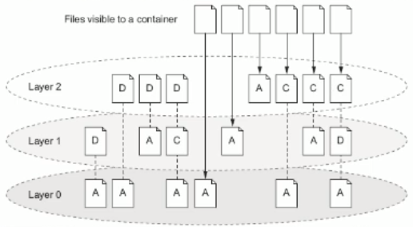

**为什么会用到存储卷：**

关闭并重启容器,其数据不受影响;但删除 Docker容器,则其更改将会全部丢失
存在的问题
	存储于联合文件系统中,不易于宿主机访问
	容器间数据共亭不便
	删除容器其数据会丢失
解决方案:“卷(volume)“
	“卷"是容器上的一个或多个“目录”,此类目录可绕过联合文件系统,与宿主机上的某目录“绑定(关联)”

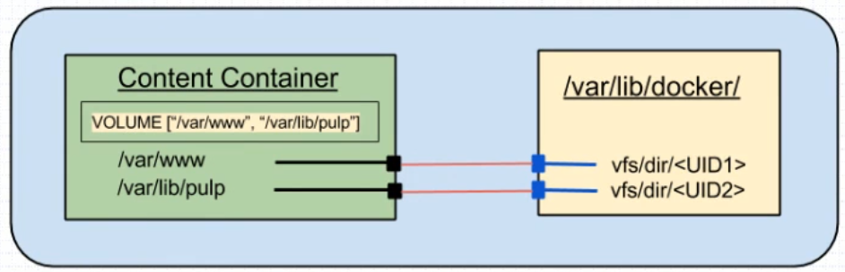

**存储卷(Data volumes)**：

Data volumes provide several useful features for persistent or shared data
	Volume于容器初始化之时即会创建,由 base image提供的卷中的数据会于此期间完成复制
	Data volumes can be shared and reused among containers
	Changes to a data volume are made directly
	Changes to a data volume will not be included when you update an image
	Data volumes persist even if the container itself is deleted

Volume的初衷是独立于容器的生命周期实现数据持久化,因此删除容器之时既不会删除卷,也不会对哪怕未被引用的卷做垃圾回收操作

卷为 docker提供了独立于容器的数据管理机制
	可以把“镜像”想像成静态文件,例如“程序”,把卷类比为动态内容,例如“数据";于是,镜像可以重用,而卷可以共享;
	卷实现了“程序(镜像)”和“数据(卷)"分离,以及“程序(镜像)”和“制作镜像的主机分离,用户制作镜像时无须再考虑镜像	运行的容器所在的主机的环境

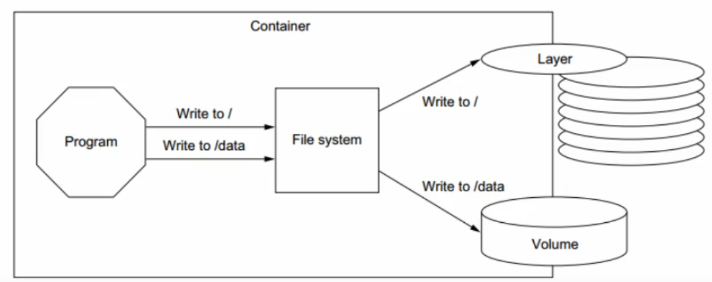

**存储卷类型：**

Docker有两种类型的卷,每种类型都在容器中存在一个挂载点,但其在宿主机上的位置有所不同
	Bind mount volume
		a volume that points to a user-specified location on the host file system
	Docker-managed volume
		the Docker daemon creates managed volumes in a portion of the hosts file system thats owned by
		Docker

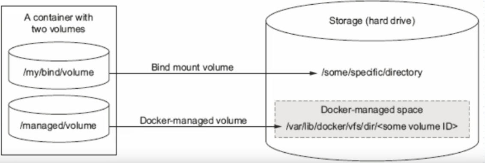

**在容器中使用volume**：

为 docker run命令使用-v选项即可使用 Volume
	Docker-managed volume
		docker run -it -name bbox1 -v /data busybox
		docker inspect -f {{.Mounts}} bbox1
			查看bbox1容器的卷、标识符及挂载的主机目录
	Bind-mount Volume
		docker run -it- v HOSTDIR:VOLUMEDIR --name bbox2 busybox
		docker inspect-f {{.Mounts}} bbox2

例子：

Docker管理卷

启动容器并指定容器本地的数据目录为/data

```shell
docker run --name b2 -it -v /data busybox
```

此时我们的根目录下面就会有一个data目录。

```shell
/ # ls /
bin   data  dev   etc   home  proc  root  sys   tmp   usr   var
```

在宿主机上面查看这个容器的信息

```shell
docker inspect b2
```

```shell
"Mounts": [
            {
                "Type": "volume",
                "Name": "8efa40720b50095aa9083c014bc4cce3f170a55f2aecfd16c540fc1cac7792d2",
                "Source": "/var/lib/docker/volumes/8efa40720b50095aa9083c014bc4cce3f170a55f2aecfd16c540fc1cac7792d2/_data",
                "Destination": "/data",
                "Driver": "local",
                "Mode": "",
                "RW": true,
                "Propagation": ""
            }
        ],

"Volumes": {
                "/data": {}
            },

```

通过上面的信息可以知道，存储卷的目录为/data，然后绑定的本地路径为：

```
/var/lib/docker/volumes/8efa40720b50095aa9083c014bc4cce3f170a55f2aecfd16c540fc1cac7792d2/_data
```

我们在本地路径中新建一个文件，那么容器内的data里面也会新增一个，同理我们在容器的内部新建一个文件本地的绑定目录里面也会新增这个文件。

```shell
echo "hello container" >> test.txt
```

Bind挂载卷：

启动容器并指定宿主机目录

```shell
docker run --name b3 -it --rm -v /data/volumes/b3:/data busybox
```

同理我们在宿主机的/data/volumes/b3目录新建文件在容器的/data目录会同步，在容器里面新建在宿主机的目录里面也会同步。

```shell
"Mounts": [
            {
                "Type": "bind",
                "Source": "/data/volumes/b3",
                "Destination": "/data",
                "Mode": "",
                "RW": true,
                "Propagation": "rprivate"
            }
        ],
```

直接查看Mounts的内容：

```shell
docker inspect -f {{.Mounts}} b3
[{bind  /data/volumes/b3 /data   true rprivate}]
```

**Sharing Volumes：**

There are two ways to share volumes between containers
	多个容器的卷使用同一个主机目录,例如
		docker run ---name cl -v /docker/volumes/v1: /data busybox
		docker run -it --name c2 -v /docker/volumes/v1: /data busybox
	复制使用其它容器的卷,为 docker run命令使用-- volumes-from选项
		docker run -it --name bbox -v /docker/volumes/v1: /data busybox
		docker run -it --name bbox2 --volumes-from bbox1 busybox

例子：

```shell
docker run --name v1 -it -v /data/volumes/base:/data/web/html busybox
```

我们在html下面新建一个index.html

```shell
echo "hello world" >> index.html
```

然后启动v2复制v1的存储卷

```shell
docker run --name v2 -it --volumes-from v1 busybox
```

在v2中已经有v1的目录而且有index.html

## 2.8.Dockerfile

**镜像的生成途径：**

​	Dockerfile

​	基于容器制作

**概念：**

Dockerfile is nothing but the source code for building Docker images
	Docker can build images automatically by reading the instructions from a Dockerfile
	A Dockerfile is a text document that contains all the commands a user could call on
	the command line to assemble an image
	Using docker build users can create an automated build that executes several
	command-line instructions in succession

**Dockerfile格式：**

Format：

- #Comment
- INSTRUCTION arguments

The instruction is not case-sensitive

​	However. convention is for them to be UPPERCASE to distinguish them from
​	arguments more easily
Docker runs instructions in a Dockerfile in order
The first instruction must be FROM in order to specify the Base Image from which you are building

.dockerignore：构建镜像时需要忽略的目录

**Environment replace：**

引用变量：$variable_name，${variable_name}

${variable:-word}如果有这个变量则这个值是已经设置了的值，否则结果就是word

${variable:+word}如果有这个变量则这个值是word的值，否则结果就是空字符串

**Dockerfile Instructions：**

**FROM**
	FROM指令是最重要的一个且必须为 Dockerfile文件开篇的第一个非注释行,用于为映像文件构建过程指定基准镜像,后续的指令运行于此基准镜像所提供的运行环境
	实践中,基准镜像可以是任何可用镜像文件,跌认情况下, docker build会在docker主机上查找指定的镜像文件,在其不存在时,则会从 Docker Hub Registry上拉取所需的镜像文件
		如果找不到指定的镜像文件, docker build会返回一个错误信息

Syntax

​	FROM <repository>[: <tag>]或
​	FROM <resository>@<digest>
​		< reposotiry>:指定作为 base image的名称;
​		<tag>: base imaget的标签,为可选项,省略时默认为 latest;

**MAINTAINER**(depreacted)

用于让 Dockerfile制作者提供本人的详细信息
Dockerfile-并不限制 MAINTAINER指令可在出现的位置,但推荐将其放置于FROM指令之后
Syntax
	MAINTAINER <authtor's detail>
		<author's detail>可是任何文本信息,但约定俗成地使用作者名称及邮件地址
		MAINTAINER"yifeng<yifeng@qq.com>"

**LABEL**

The LABEL instruction adds metadata to an image
	Syntax: LABEL <key>=<value><key>=<value> <key>=<value>
	The LABEL instruction adds metadata to an image
	A LABEL is a key-value pair
	To include spaces within a LABEL value, use quotes and backslashes as you would in
		command-line parsing
	An image can have more than one label
	You can specify multiple labels on a single line

**COPY**

用于从 Docker主机复制文件至创建的新映像文件
Syntax
	COPY <src>...<dest>或
	COPY["<src>",..."<dest>"]
		<src>:要复制的源文件或目录,支持使用通配符
		<dest>:目标路径,即正在创建的image的文件系統路径;建议为<dest>使用绝对路径,否则COPY指定则以 			WORKDIR为其起始路径;
	注意:在路径中有空白字符时,通常使用第二种格式
文件复制准则
	<src>必须是build上下文中的路径,不能是其父目录中的文件
	如果<src>是目录,则其内部文件或子目录会被递归复制,但<src>目录自身不会被复制
	如果指定了多个<sc>,或在<src>中使用了通配符,则<dest>必须是一个目录,且必须以/结尾
	如果<dest>事先不存在,它将会被自动创建,这包括其父目录路径

**ADD**

ADD指令类似于COPY指令,ADD支持使用TAR文件和URL路径
Syntax
	ADD<src>...<dest>或
	ADD["<src>",..."<dest>"]
操作准则
	同COPY指令
	如果<src>为URL且<dest>不以/结尾,则<src>指定的文件将被下载并直接被创建为<dest>;如果<dest>以/结尾,则文件名URL指定的文件将被直接下载并保存为<dest>/< filename>
	如果<src>是一个本地系统上的压缩格式的tar文件,它将被展开为一个目录,其行为类似于"tarーx"命令;然而,通过URL获取到的tar文件将不会自动展开
	如果<src>有多个,或其间接或直接使用了通配符,则<dest>必须是一个以/结尾的目录路径如果<dest>不以/结尾,则其被视作ー个普通文件,<src>的内容将被直接写入到<dest>;

**WORKDIR**

用于为 Dockerfile 中所有的RUN、CMD、 ENTRYPOINT、COPY和ADD指定
设定工作目录
Syntax
	WORKDIR <dirpath>
		在 Dockerfile文件中, WORKDIR指令可出现多次,其路径也可以为相对路径,不过,其是相对此前一个 WORKDIR指令指定的路径
		另外, WORKDIR也可调用由ENV指定定义的变量
	例如
		WORKDIR /var/log
		WORKIIR $STATEPATH

**VOLUME**

用于在 Image中创建一个挂载点目录,以挂载 Docker host上的卷或其它容器上的
Syntax
	VOLUME< mountpoint>或
	VOLUME "<mountpoint >"
如果挂载点目录路径下此前在文件存在, docker run命令会在卷挂载完成后将此前的所有文件复制到新挂载的卷中

**EXPOSE**

用于为容器打开指定要监听的端口以实现与外部通信
Syntax
EXPOSE <port> [/<protocol>] [<port>[/<protocol>]...]

​	<protocol>用于指定传输层协议,可为tcp或udpニ者之ー,默认为TCP协议
EXPOSE指令可一次指定多个端口,例如
​	EXPOSE 11211/udp 11211/tcp

**ENV**

用于为镜像定义所需的环境变量,并可被 Dockerfile文件中位于其后的其它指令(如ENV、ADD、COPY等)所调用
调用格式为 $variable_name或${variable_name}
Syntax
	ENV<key>< value>或
	ENV<key>=<value>...
第一种格式中,<key>之后的所有内容均会被视作其< value>的组成部分,因此,一次只能设置一个变量
第二种格式可用一次设置多个变量,每个变量为一个"<key>=< value>"的键值对,如果<value>中包含空格,可以以反斜线(\)进行转义,也可通过对< value>加引号进行标识;另外,反斜线也可用于续行;
定义多个变量时,建议使用第二种方式,以便在同一层中完成所有功能

**Instructions**

CMD

​	类似于RUN指令,CMD指令也可用于运行任何命令或应用程序,不过,二者的运行时间点不同
​		RUN指令运行于镜像文件构建过程中,而CMID指令运行于基于Dockerfile构建出的新镜像
文件启动一个容器时
​		CMD指令的首要目的在于为启动的容器指定默认要运行的程序,且其运行结结后,容器也将终止;不过,CMD指定的命令其可以被 docker run的命令行选项所覆盖
​		在 Dockerfile中可以存在多个CMD指令,但仅最后一个会生效
Syntax
​	CMD< command>或
​	CMD["<executable>","<param1>","<param2>" ]或
​	CMD [ <param1>", " <param2>"]
​	前两种语法格式的意义同RUN
​	第三种则用于为 ENTRYPOINT指令提供默认参数

RUN

​	用于指定 docker build过程中运行的程序,其可以是任何命令
Syntax
​	RUN< command>或
​	RUN["<executable>","<param1>","<param2>" ]
第一种格式中,<command>通常是一个shell命令,且以“/bin/sh -c"来运行它,这意味着此进程在容器中的PID不为1,不能接收Unix信号,因此,当使用 docker stop< container>命令停止容器时,此进程接收不到 SIGTERM信号
第二种语法格式中的参数是一个JSON格式的数组,其中<executable>为要运行的命令,后面的<param>为传递给命令的选项或参数;然而,此种格式指定的命令不会以"/bi/sh -c"来发起,因此常见的shell操作如变量替换以及通配符(,*等)替换将不会进行;不过,如果要运行的命令依赖于此shell特性的话,可以将其替换为类似下面的格式。
​	RUN[ "/bin/bash","-c","<executable>","<param1>"]

**ENTRYPOINT**

​	类似CMD指令的功能,用于为容器指定默认运行程序,从而使得容器像是一个单独的可执行程序
​	与CMD不同的是,由 ENTRYPOINT启动的程序不会被 docker run命令行指定的参数所覆盖,而且,这些命令行参数会被当作参数传递给 ENTRYPOINT指定指定的程序
​		不过, docker run命令的--entrypoint选项的参数可覆盖 ENTR YPOINT指令指定的程序
Syntax
​	ENTRYPOINT <command>
​	ENTRYPOINT["<executable>","<param1>","<param2>" ]
docker run命令传入的命令参数会覆盖CMD指令的内容并且附加到ENTRYPOINT命令最后做为其参数使用
Dockerfile文件中也可以存在多个 ENTRYPOINT指令,但仅有最后一个会生效

**User**

​	用于指定运行 "image时的或运行 Dockerfile中任何RUN、CMD或 ENTRYPOINT指令指定的程序时的用户名或UID
​	默认情况下, container的运行身份为root用户
​	Syntax
​		USER<UID>I<Username>
​		需要注意的是,<UID>可以为任意数字,但实践中其必须为/etc/ passwd中某用户的有效UID,否则, docker run命令将运行失败

**HEALTHCHECK**

​	The HEALTHCHECK instruction tells Docker how to test a container to check that it is still working
​	This can detect cases such as a web server that is stuck in an infinite loop and unable to handle new connections, even though the server process is still running
​	The HEALTHCHECK instruction has two forms:
​		HEALTHCHECK [OPTIONS] CMD command (check container health by running a command inside the container)
​		HEALTHCHECK NONE (disable any healthcheck inherited from the base image)

The options that can appear before CMD are:
	--interval=DURATION (default: 30s)
    --timeout=DURATION(default: 30s)
	--start-period= DURATION (default: 0s)
	--retries=N(default: 3)
The command‘s exit status indicates the health status of the container. The possible values are.
	0: success -the container is healthy and ready for use
	1: unhealthy -the container is not working correctly
	2: reserved-do not use this exit code
For example
0 Healthcheck--interval=5m --timeout=3s
	CMD curl -f http://localhost/ || exit 1

**SHELL**

The SHELL instruction allows the default shell used for the shell form of commands to be overridden
The default shell on Linux is ["/bin/sh","-c"], and on Windows is ["cmd","/S","/C"]
The SHELL instruction must be written in JSON form in a Dockerfile
Syntax: SHELL ["executable", "parameters"]
The SHELL instruction can appear multiple times
Each SHELL instruction overrides all previous SHELL instructions, and affects all subsequent Instructions.

**STOPSIGNAL**

The STOPSIGNAL instruction sets the system call signal that will be sent to the container to exit
This signal can be a valid unsigned number that matches a position in the kernels syscall table, for instance 9, or a signal name in the format SIGNAME, for instance
SIGKIL
Syntax: STOPSIGNAL signal

**ARG**

The ARG instruction defines a variable that users can pass at build-time to the
builder with the docker build command using the --build-arg <varname>=<value>
If a user specifies a build argument that was not defined in the Dockerfile, the build
outputs a warning.
Syntax: ARG <name>[=<default value>]
A Dockerfile may include one or more ARG instructions
An ARG instruction can optionally include a default value
	ARG version=1.14
	ARG user=magee

docker build过程中可以覆盖arg的参数值，二环境变量env则不行

**ONBUILD**

用于在 Dockerfile中定义一个触发器
Dockerfile用于 build映像文件,此映像文件亦可作为 base image被另ー个 Dockerfile用作FROM指令的参数,并以之构建新的映像文件
在后面的这个 Dockerfile中的FROM指令在 build过程中被执行时,将会“触发”创建其 base image的 Dockerfile文件中的 ONBUILD指令定义的触发器
Syntax
ONBUILD <INSTRUCTION>
尽管任何指令都可注册成为触发器指令,但 ONBUILD不能自我嵌套,且不会触发FROM和MAINTAINER指令
使用包含 ONBUILD指令的 Dockerfile构建的镜像应该使用特殊的标签,例如ruby:2.0-onbuild
在 ONBUILL指令中使用AIDD或COPY指令应该格外小心,因为新构建过程的上下文在缺少指定的源文件时会失败

## 2.9.Docker Registry

Registry用于保存 dockers镜像,包括镜像的层次结构和元数据

用户可自建 Registry,也可使用官方的 Docker Hub

分类：

- Sponsor Registry:第三方的 registry,供客户和 Docker社区使用
- Mirror Registry:第三方的 registry,只让客户使用
- Vendor Registry:由发布 Docker镜像的供应商提供的 registry
- Private Registry:通过设有防火墙和额外的安全层的私有实体提供的registry

**Docker Compose**

Docker单机编排

**Harbor：**

Project Harbor is an an open source trusted cloud native registry project that stores, Signs, and scans content
Harbor extends the open source Docker Distribution by adding the functionalities usually required by users such as security identity and management
Harbor supports advanced features such as user management, access control, activity monitoring, and replication between Instances

**Features**

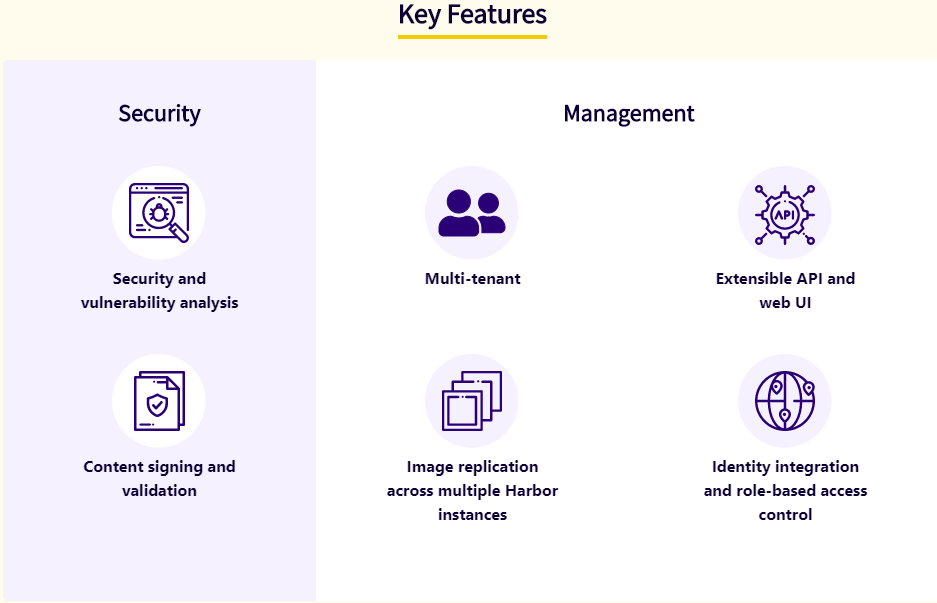

## 2.10.Limit a container's resources

By default. a container has no resource constraints and can use as much of a given resource as the host’s kernel scheduler allows
Docker provides ways to control how much memory, CPU, or block IO a container can use, setting runtime configuration flags of the docker run command
Many of these features require your kernel to support Linux capabilities
	To check for support, you can use the docker info command

Memory

​	OOME

​		On Linux hosts. if the kernel detects that there is not enough memory to perform important system functions, it throws an OOME, or Out Of Memory Exception, and starts killing processes to free up memory
​	一旦发生OOME,任何进程都有可能被杀死,包括 docker daemon在内
​	为此, Docker特地调整了 docker daemon的OOM优选级,以免它被内核“正法”,但容器的优选级并未被调整

CPU

By default, each container s access to the host machine s CPU cycles is unlimate
You can set various constraints to limit a given container s access to the host machine ' s CPU cycles
Most users use and configure the default CFS scheduler
In Docker 1. 13 and higher, you can also configure the realtime scheduler