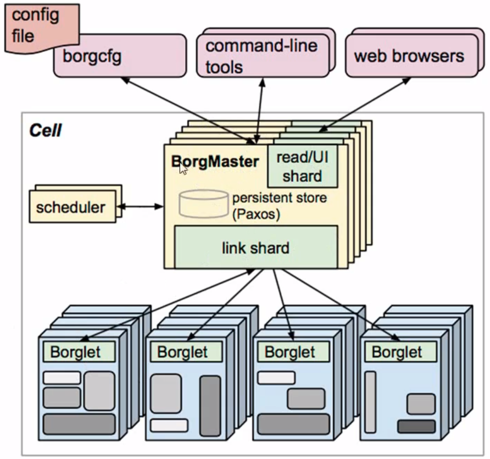
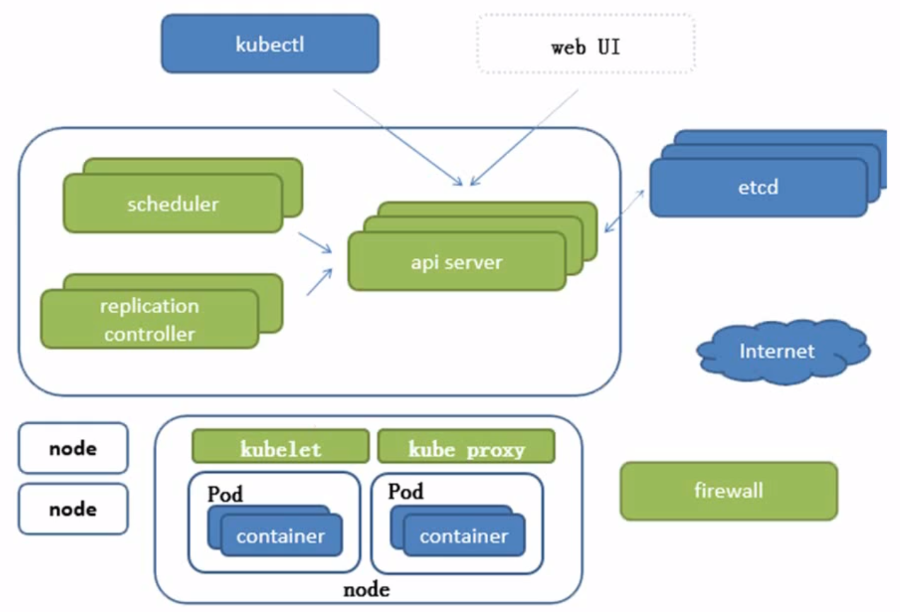
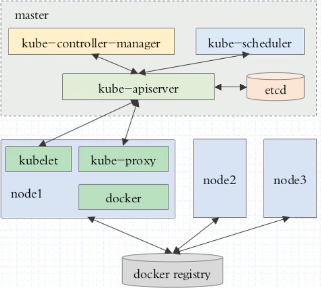
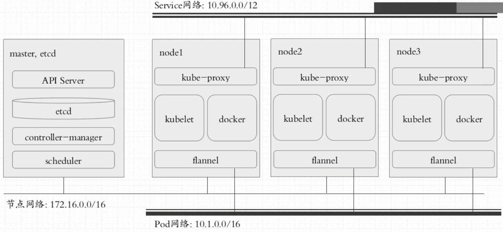
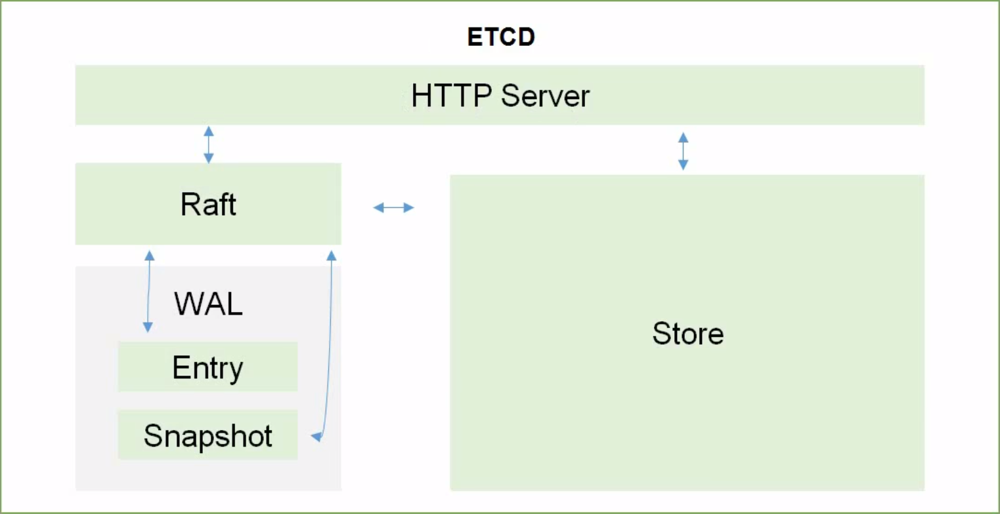
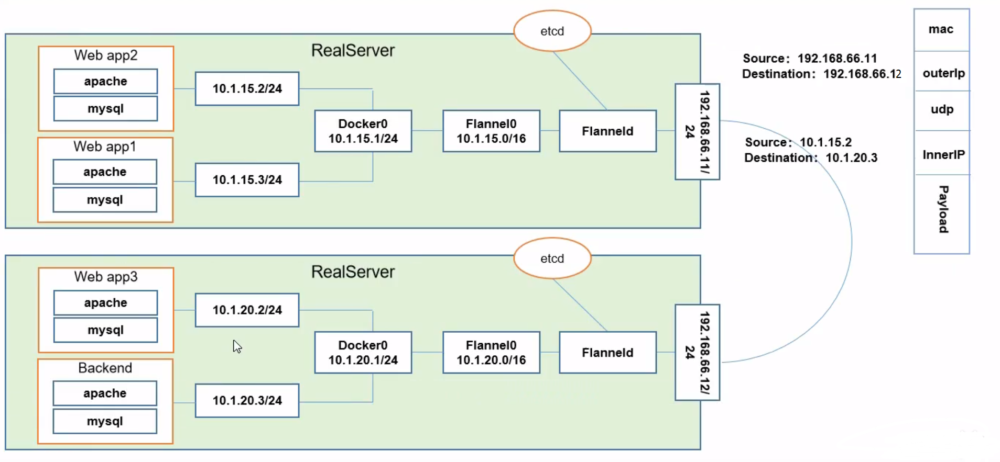
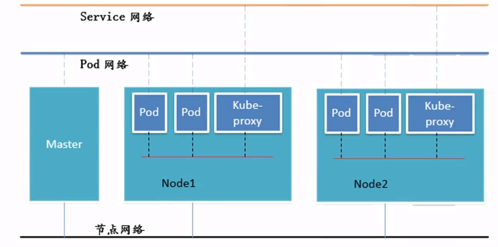

# Kubernetes

# 1.概述

IAAS：Infrastructure as a service，基础设施及服务，阿里云、aws等

PAAS：platform as aservice，平台及服务，新浪云，Google App Engine

SAAS：software as a service，软件及服务，

应用编排：Ansible、Saltstack

容器：Docker

容器编排：

​	单机编排：Docker compose

​	 集群编排：

​			Docker swarm（2019-7 阿里云剔除docker swarm），Docker machine

​			mesos（apache，分布式资源管理框架，2019-5 twitter抛弃mesos转战kubernetes）， marathon

​			kubernates（Google 10年容器化基础架构 borg go语言）

go语言在语言级别支持进程管理

DevOps

MicroService

Blockchain

CI：持续集成

CD：持续交付Delivery

CD：持续部署Deployment

kubernetes：希腊语舵手的意思

Borg

特点：

- 轻量级：消耗资源小
- 开源
- 弹性伸缩
- 负载均衡：IPVS

特性：

- 自动装箱
- 自我修复
- 水平扩展
- 服务发现和负载均衡
- 自动发布和回滚
- 密钥和配置管理
- 存储编排
- 批量处理执行

集群架构模式：master/node(为了保证高可用mater一般三个以上)

master：API Server，Scheduler，Controller-Manager

node：kubelet，docker，kube-proxy

Pod：Label，Label Selector

​	Label：key=value

​	Label Selector：

Pod分类：

​	自主式Pod

​	控制器管理的Pod：

​		ReplicationController

​		ReplicaSet

​		Deployment

​		StatefulSet

​		DaemonSet

​		Job，Ctonjob

​		HPA（HorizontalPodAutoscaler）

网络模式：

Node节点网络-->注册中心service网络-->Pod网络

同一Pod内的多个容器：lo

各Pod之间的通信：

Pod与Service之间的通信

CNI:

​	flannel:网络配置

​	calico：网络配置，网络策略

​	canel：

# 2.系统架构

Borg的系统架构：

kubernetes架构：

# 3.组件说明：

## 3.1.apiserver

所有服务访问的统一入口，服务发现与注册

## 3.2.ControllerManager

维持副本期望数目

## 3.3.scheduler

调度器，选择合适的节点进行任务分配

## 3.4.etcd

etcd的官方将它定位成一个可信赖的分布式键值存储服务，它能够为整个分布式集群存储些关键数据,协助分布式集群的正常运转。推荐在 Kubernetes集群中使用 Etcd v3,v2版本已在 Kubernetes v1.11中弃用。v2版本会将数据存储在内存中，v3则会在本地存储

## 3.5.Kubelet

直接跟容器引擎（如Docker）交互实现容器的生命周期管理

## 3.6.Kube-proxy

负责写入规则至iptables、IPVS实现服务映射访问

## 3.7.其他插件

COREDNS：可以为集群中的svc创建一个域名IP的对应关系解析

dashboard：给k8s集群提供一个B/S结构访问体系

Ingress Controller：官方只能实现四层代理，而它可以实现七层代理

federation：提供一个可以跨集群中心多k8s统一管理功能

prometheus：提供k8s集群监控能力

elk：提供k8s集群日志统一分析接入平台

# 4.Pod

## 4.1.分类

自主式Pod（共享存储和网络）

控制器管理的Pod（由控制器来管理）

## 4.2.控制器

Replicationcontroller：

Replicationcontroller用来确保容器应用的副本数始终保持在用户定义的副本数,即如果有容器异常退出,会自动创建新的Pod来替代;而如果异常多出来的容器也会自动回收。

ReplicaSet

在新版本的 Kubernetes中建议使用 Replicaset来取代 Replicationcontroller,Replicaset跟 Replicationcontroller没有本质的不同,只是名字不ー样,并且ReplicaSet支持集合式的 selector

Deployment：

虽然 Replicaset可以独立使用,但一般还是建议使用 Deployment来自动管理，ReplicaSet,这样就无需担心跟其他机制的不兼容问题(比如 Replicaset不支持rolling-update但 Deployment支持)

HPA：

Horizontal Pod Autoscaling仅适用于 Deployment和 Replicaset,在V1版本中仅支持根据Pod的CPU利用率扩所容,在 v1alpha版本中,支持根据内存和用户自定义的 metric扩缩容

StatefulSet：

Statefulset是为了解决有状态服务的问题(对应 Deployments和 ReplicaSets是为无状态服务而设计),其应用场景包括：
		稳定的持久化存储,即Pod重新调度后还是能访问到相同的持久化数据,基于PVC来实现
		稳定的网络标志,即Pod重新调度后其 PodName和 HostName不变,基于 Headless Service
			(即没有 Cluster IP的 Service)来实现
		有序部署,有序扩展,即Pod是有顺序的,在部署或者扩展的时候要依据定义的顺序依次依次进
			行(即从0到N-1,在下一个Pod运行之前所有之前的Pod必须都是 Running和 Ready状态)
			基于 Init containers来实现
		有序收缩,有序删除(即从N-1到0）

DaemonSet：

DaemonSet确保全部(或者一些)Node上运行一个Pod的副本。当有Node加入集群时,也会为他们新增一个Pod。当有 Node从集群移除时,这些Pod也会被回收。删除 DaemonSet将会刷除它创建的所有Pod
使用 Daemonset的一些典型用法:
	运行集群存储 daemon,例如在每个Node上运行 glusterd、ceph
	在每个Node上运行日志收集 daemon,例如 fluent、 logstash。
	在每个Node上运行监控 daemon,例如 Prometheus Node Exporter

Job：

Job负责批处理任务,即仅执行一次的任务,它保证批处理任务的一个或多个Pod成功结束

Cronjob：

Cron Job管理基于时间的Job,即:
	在给定时间点只运行一次
	周期性地在给定时间点运行

# 5.网络通讯

Kubernetes的网络模型假定了所有Pod都在一个可以直接连通的扁平的网络空间中,这在GCE( Google Compute Engine)里面是现成的网络模型, Kubernetes假定这个网络己经存在。而在私有云里搭建 Kubernetes集群,就不能假定这个网络已经存在了。我们需要自己实现这个网络假设,将不同节点上的 Docker容器之间的互相访问先打通,然后运行 Kubernetes

同一个Pod内的多个容器之间:lo
各Pod之间的通讯:Overlay Network
Pod与 Service之间的通讯:各节点的 Iptables规则

Flannel：

Flannel是 Cores闭队针对 Kubernetes设计的一个网络规划服务,简单来说,它的功能是让集群中的不同节点主机创建的 Docker容器都具有全集群唯一的虚拟IP地址。而且它还能在这些IP地址之间建立一个覆盖网络(Overlay Network),通过这个覆盖网络,将数据包原封不动地传递到目标容器内

ETCD之 Flannel提供说明:
	存储管理 Flannel可分配的IP地址段资源
	监控ETCD中每个Pod的实际地址,并在内存中建立维护Pod节点路由表

Pod之间通讯方式：

- 同一个Pod内部通讯:同一个Pod共享同一个络命名空间,共享同一个 Linux协议栈

- Pod1至Pod2

​	Pod1与Pod2不在同一台主机,Pod的地址是与 docker0在同一个网段的,但docker0网段与宿主机网卡是两个完
​		全不同的IP网段,并且不同Node之间的通信只能通过宿主机的物理网卡进行。将Pod的IP和所在Node的IP关联		起来,通过这个关联让Pod可以互相访问
​	Pod1与Pod2在同一台机器,由 Docker0网桥直接转发请求至Pod2,不需要经过 Flannel

- Pod至 Service的网络:目前基于性能考虑,全部为 iptables（新版LVS）维护和转发
- Pod到外网:Pod向外网发送请求,查找路由表,转发数据包到宿主机的网卡,宿主网卡完成路由选择后, iptables执
  行 Masquerade,把源IP更改为宿主网卡的IP,然后向外网服务器发送请求
- 外网访问Pod: Service

# 6.安装

